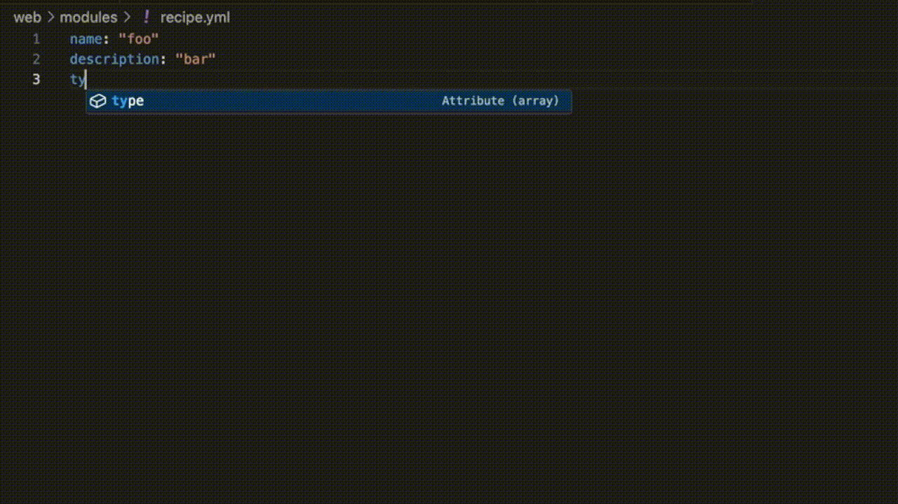

# Drupal Recipes Autocomplete: VS Code Extension
VS Code extension that provides autocomplete for Drupal Recipes

## Features

- Autocomplete for recipe.yml.

## Instructions

- Enable the extension in VS Code as usual
- Create a file called recipe.yml inside a folder on an existing Drupal codebase. The extension will provide autocomplete functionality fetching details from the Drupal codebase.
- To trigger autocomplete, use ^ + Space.

## Repository
https://github.com/marcelovani/drupal-recipes-autocomplete-vscode

## TODO
- List the extension as NPM package in https://www.npmjs.com/
- Add extension icon in package.json
- Use schemas to provide autocomplete items, depends on https://www.drupal.org/project/distributions_recipes/issues/3475786
- Automatically generate composer.json for the Recipe
- Support Default Content
- Do not show autocomplete items that are already in the Recipe
- Finish autocomplete for Actions and all child items
- Fix autocomplete for items that are not directly below the parent, see getParentAttribute()
- Add 'icon' to package.json

