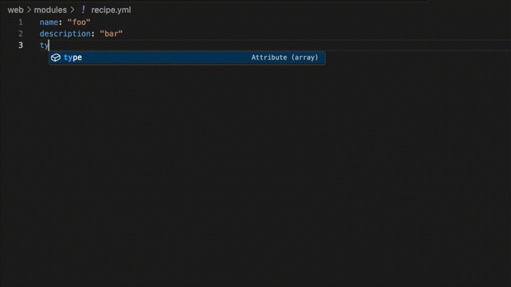

# Drupal Recipes Autocomplete: VS Code Extension
VS Code extension that provides autocomplete for Drupal Recipes

## Features

- Provides autocomplete suggestions for Drupal recipes.
- Provides validation for recipe.yml, via the [Drupal recipe JSON schema](https://github.com/SchemaStore/schemastore/blob/master/src/schemas/json/drupal-recipe.json)
  on SchemaStore — see [docs/json-schema.md](./docs/json-schema.md).
- See the list of [supported Config actions](https://github.com/marcelovani/drupal-recipes-autocomplete-vscode/wiki/Properties)

## Instructions

- Enable the extension in VS Code as usual
- Create a file called recipe.yml inside a folder on an existing Drupal codebase. The extension will provide autocomplete functionality fetching details from the Drupal codebase.
- To trigger autocomplete, use ^ + Space.

## Video

## Contribute

Contributions are more than welcome! Read [CONTRIBUTING.md](./CONTRIBUTING.md) for more information,
and [docs/testing.md](./docs/testing.md) for how to run the tests.
[docs/tracking-drupal-recipes.md](./docs/tracking-drupal-recipes.md) covers how support for new
Drupal config actions gets tracked and ported, and [docs/releasing.md](./docs/releasing.md)
covers publishing.

## Repository
https://github.com/marcelovani/drupal-recipes-autocomplete-vscode

## TODO
- List the extension as NPM package in https://www.npmjs.com/
- Automatically generate composer.json for the Recipe
- Support Default Content
- Do not show autocomplete items that are already in the Recipe
- Fix Lint warnings

## License

MIT — see [LICENSE.md](./LICENSE.md). Free to use, modify and redistribute,
provided as is and without warranty of any kind.

This extension began as part of the
[Drupal extension for VS Code](https://github.com/kaermorchen/vscode-drupal),
also MIT, whose copyright notice is kept alongside ours.
[THIRD-PARTY-NOTICES.md](./THIRD-PARTY-NOTICES.md) covers the code bundled into
the published extension.

